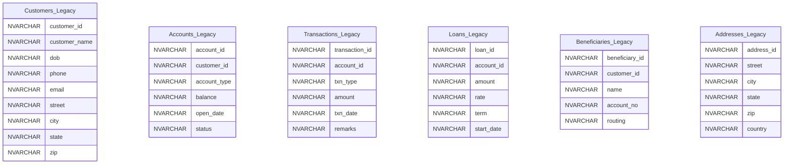
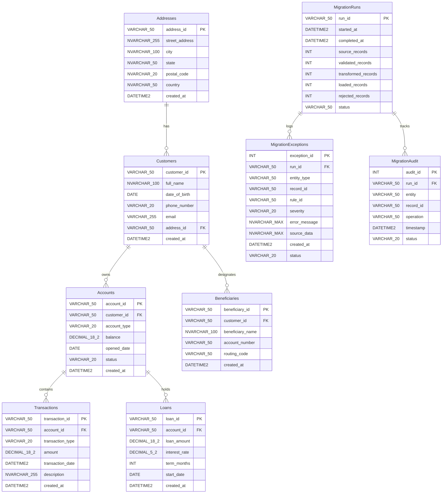
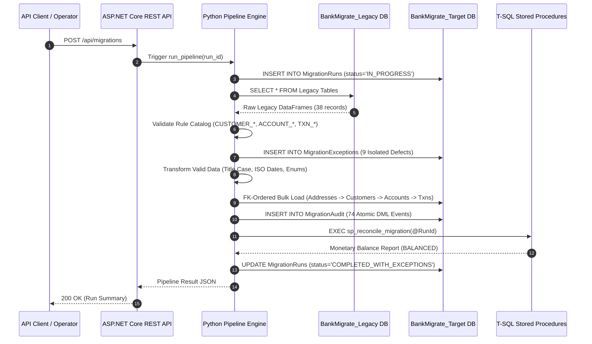

# BankMigrate — Enterprise Banking Data Migration Platform

[](file:///Users/piyushisinghal/Downloads/BankMigrate/tests)
[](file:///Users/piyushisinghal/Downloads/BankMigrate/api)
[](file:///Users/piyushisinghal/Downloads/BankMigrate/scripts/sql)

BankMigrate is an enterprise-grade banking data migration platform designed to extract, profile, validate, transform, bulk-load, reconcile, and audit legacy banking data from an unconstrained source database (`BankMigrate_Legacy`) into a normalized, constraint-enforced target database (`BankMigrate_Target`).

---

## System Architecture

```mermaid
graph TD
    subgraph Source Layer
        LegacyDB[BankMigrate_Legacy Database<br/>6 Unconstrained Legacy Tables]
    end

    subgraph Core Migration Engine (Python)
        Ext[1. Extractor Module]
        Prof[2. Profiler Module]
        Val[3. Validator Module & Rule Catalog]
        Trans[4. Transformer Module]
        Load[5. Target Bulk Loader]
        Recon[6. Reconciliation Engine]
        Audit[7. Audit & Run Logger]
        Exc[8. Exception Handler]
    end

    subgraph Destination & Operations Layer (SQL Server)
        TargetDB[BankMigrate_Target Database]
        RunsTab[(MigrationRuns Table)]
        ExTab[(MigrationExceptions Store)]
        AuditTab[(MigrationAudit Trail)]
        SPs[T-SQL Stored Procedures]
    end

    subgraph Control & Orchestration Layer
        API[ASP.NET Core REST API Controller]
        Sched[APScheduler Background Worker]
    end

    LegacyDB --> Ext
    Ext --> Prof
    Prof --> Val
    Val -- Isolated Defects --> Exc
    Exc --> ExTab
    Val -- Valid Records --> Trans
    Trans --> Load
    Load --> TargetDB
    Load --> AuditTab
    Audit --> RunsTab
    TargetDB --> SPs
    SPs --> Recon
    API --> Ext
    API --> RunsTab
    API --> ExTab
    Sched --> Ext
```

---

## Entity-Relationship (ER) Diagrams

### 1. Source Schema (`BankMigrate_Legacy`)
Unconstrained, non-normalized legacy banking tables with `NVARCHAR` types and deliberate data quality defects.



---

### 2. Target Normalized Schema (`BankMigrate_Target`)
Clean 3NF banking domain model enforcing primary keys, foreign keys, explicit data types (`DATE`, `DATETIME2`, `DECIMAL(18,2)`), and operational tracking tables.



---

## Pipeline Execution Sequence



---

## Key Features

- **Dual-Layer Validation:** Python application-level rule engine + T-SQL stored procedures (`sp_validate_customers`, `sp_validate_accounts`, `sp_validate_transactions`, `sp_detect_duplicates`).
- **Defect Isolation Store:** Preserves 100% of rejected records in `MigrationExceptions` with immutable Rule IDs and raw JSON source snapshots. Zero silent data loss.
- **Automated Financial Reconciliation:** Verifies mathematical count balance ($\text{Source} = \text{Valid} + \text{Rejected}$) and monetary balance via `sp_reconcile_migration` ($\text{Source Txn Sum} = \text{Target Txn Sum} + \text{Rejected Txn Sum}$).
- **ASP.NET Core REST API:** .NET 8 Web API providing RESTful management and reporting endpoints (`GET /api/migrations`, `GET /api/migrations/{runId}/exceptions`, `GET /api/migrations/{runId}/reconciliation`, `POST /api/migrations/{runId}/retry`).
- **Automated Background Scheduler:** Cron & interval recurring batch execution using `APScheduler`.
- **Failure Recovery & Disaster Resilience:** Catches network drops or table lock timeouts (`NETWORK_DROP`, `LOCKED_TABLE`), transitions run state to `FAILED`, and recovers cleanly via retry.
- **Security Hardened:** Least-privilege SQL Server role (`bankmigrate_app_role`), 100% query parameterization, dynamic environment secrets, PII masking (`sanitizer.py`).

---

## Repository Structure

```text
BankMigrate/
├── api/                            # ASP.NET Core 8 Web API (.NET 8 C#)
│   ├── Controllers/MigrationController.cs
│   ├── Services/ReportingService.cs & MigrationService.cs
│   └── Models/MigrationModels.cs
├── docs/                           # Living Documentation Package
│   ├── BUILD_LOG.md                # Engineering build log for all 20 milestones
│   ├── architecture.md             # System architecture & Mermaid sequence diagrams
│   ├── database-schema.md          # ER diagrams for Legacy and Target schemas
│   ├── data-mapping.md             # Data mapping catalog & transformation specifications
│   └── operational-guide.md        # Deployment & operations manual
├── migration_engine/               # Core Python Data Migration Engine
│   ├── config/                     # Settings & Database connection management
│   ├── extraction/                 # Legacy SQL extraction to Pandas DataFrames
│   ├── profiling/                  # Anomaly profiling & duplicate detection
│   ├── validation/                 # Rule catalog & entity validation engine
│   ├── transformation/             # Data cleaning, ISO dates, Title Case, normalizations
│   ├── loading/                    # FK-ordered bulk loading into target SQL Server
│   ├── reconciliation/             # Count math & monetary balance reconciliation
│   ├── exceptions/                 # Exception store & failure simulator
│   ├── audit/                      # MigrationRuns & MigrationAudit logging
│   └── pipeline.py                 # Full end-to-end pipeline orchestrator
├── scheduler/                      # APScheduler automated background scheduler
├── scripts/                        # Database setup & milestone verification scripts
│   └── sql/                        # T-SQL DDL, stored procedures, & security scripts
└── tests/                          # Pytest end-to-end integration test suite
```

---

## System Verification Metrics

- **Pytest Integration Suite:** `8 passed in 1.58s` ✅
- **ASP.NET Core API Build:** `Build succeeded. 0 Warning(s), 0 Error(s)` ✅
- **SQL Server Target Load:** 29 valid records loaded cleanly in FK dependency order ✅
- **Defect Isolation Store:** 9 legacy defects caught and written to `MigrationExceptions` ✅
- **Financial Reconciliation Check:** Source (38) = Valid (29) + Rejected (9) $\rightarrow$ `BALANCED` ✅
