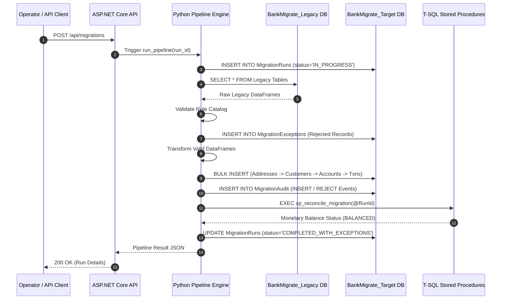

# BankMigrate — System Architecture Specification

## 1. Overview
BankMigrate is an enterprise banking data migration platform designed to extract, validate, transform, load, reconcile, and audit legacy banking data from `BankMigrate_Legacy` into a clean, normalized SQL Server target schema `BankMigrate_Target`.

The system employs a dual-layer architecture combining high-performance Python data engineering (`migration_engine`) with database-native T-SQL stored procedures, RESTful ASP.NET Core API orchestration, and background scheduling.

---

## 2. Component Architecture

```mermaid
graph TD
    subgraph Source Layer
        LegacyDB[BankMigrate_Legacy Database]
    end

    subgraph Core Processing Engine (Python)
        Ext[Extractor Module]
        Prof[Profiler Module]
        Val[Validator Module & Rule Catalog]
        Trans[Transformer Module]
        Load[Target Loader]
        Recon[Reconciler Module]
        Audit[Audit & Run Logger]
        Exc[Exception Handler]
    end

    subgraph Database Layer (SQL Server)
        TargetDB[BankMigrate_Target Database]
        RunsTab[(MigrationRuns)]
        ExTab[(MigrationExceptions)]
        AuditTab[(MigrationAudit)]
        SPs[T-SQL Stored Procedures]
    end

    subgraph Orchestration & Control Plane
        API[ASP.NET Core REST API]
        Sched[APScheduler Background Jobs]
    end

    LegacyDB --> Ext
    Ext --> Prof
    Prof --> Val
    Val -- Rejected Records --> Exc
    Exc --> ExTab
    Val -- Valid Records --> Trans
    Trans --> Load
    Load --> TargetDB
    Load --> AuditTab
    Audit --> RunsTab
    TargetDB --> SPs
    SPs --> Recon
    API --> Ext
    API --> RunsTab
    API --> ExTab
    Sched --> Ext
```

---

## 3. Data Processing Pipeline Stages

1. **Extraction Stage:** Connects to `BankMigrate_Legacy` via SQLAlchemy and PyMSSQL, extracting raw unconstrained legacy tables into in-memory Pandas DataFrames.
2. **Profiling Stage:** Computes total row counts, column-level null counts (`df.isnull().sum()`), and duplicate row counts per entity before processing.
3. **Validation Stage:** Enforces the Section 11 rule catalog (`CUSTOMER_*`, `ACCOUNT_*`, `TXN_*`). Valid records are forwarded to transformation; invalid records are isolated.
4. **Exception Handling Stage:** Writes rejected records to `MigrationExceptions` with rule ID, severity, error message, and JSON raw data snapshot.
5. **Transformation Stage:** Normalizes valid data to target specifications (Title Case, ISO `YYYY-MM-DD` dates, stripped phone digits, uppercased enums, 2-decimal rounding).
6. **Bulk Loading Stage:** Bulk inserts transformed DataFrames into `BankMigrate_Target` in strict foreign key dependency order (`Addresses` $\rightarrow$ `Customers` $\rightarrow$ `Accounts` $\rightarrow$ `Transactions` $\rightarrow$ `Loans` $\rightarrow$ `Beneficiaries`).
7. **Reconciliation Stage:** Verifies count math ($\text{Source} = \text{Valid} + \text{Rejected}$) and calls T-SQL stored procedure `sp_reconcile_migration` to verify monetary balance integrity ($\text{Source Txn Amount} = \text{Target Txn Amount} + \text{Rejected Txn Amount}$).
8. **Audit & Run Tracking Stage:** Updates `MigrationRuns` status (`COMPLETED`, `COMPLETED_WITH_EXCEPTIONS`, `FAILED`) and records atomic DML events in `MigrationAudit`.

---

## 4. Sequence Diagram



---

## 5. Technology Stack Decisions
- **Database Engine:** Microsoft SQL Server (Azure SQL Edge container) for enterprise relational modeling, ACID compliance, and stored procedure support.
- **Python Engine:** Python 3.14.5 + Pandas + PyMSSQL + SQLAlchemy for vectorised data manipulation and database connectivity.
- **API Orchestration:** .NET 8.0 C# (ASP.NET Core Web API) + Dapper for high-performance RESTful management endpoints.
- **Scheduler:** APScheduler for in-process cron and interval recurring batch execution.
