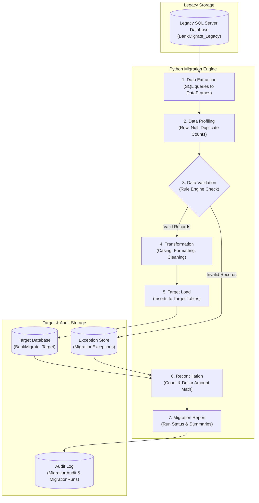
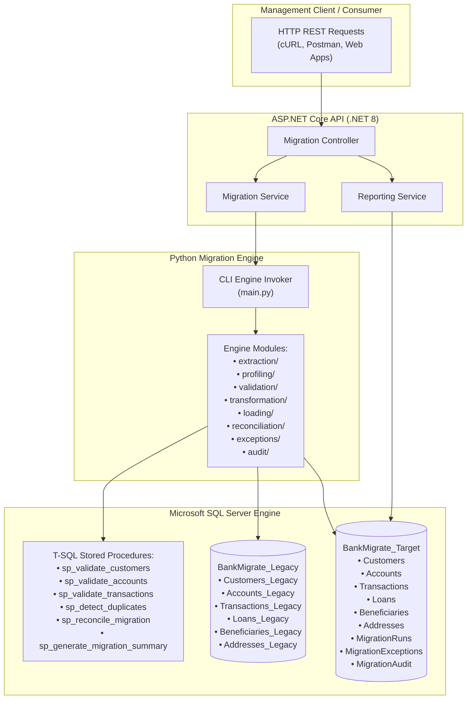

# System Architecture

## Overview
BankMigrate is an enterprise banking data migration platform designed to simulate moving inconsistent legacy banking data into a clean, normalized target system. The architecture decouples orchestration, data processing, and persistence into clear technical layers:

1. **Orchestration & REST Layer:** ASP.NET Core Web API (.NET 8 C#)
2. **Data Processing Engine:** Python 3.x with Pandas, SQLAlchemy, and T-SQL Stored Procedures
3. **Relational Storage:** Microsoft SQL Server hosting `BankMigrate_Legacy` and `BankMigrate_Target`

---

## 4.1 End-to-End Data Flow

The data pipeline processes legacy data sequentially through seven pipeline stages:

---

## 4.2 Component / Service Architecture

The system decouples RESTful HTTP management from core batch migration processing:

---

## Architecture Rationale
- **ASP.NET Core REST API:** Exposes endpoints to start, list, inspect, and retry migration runs without embedding heavyweight data processing inside web server threads.
- **Python Engine:** Utilizes Pandas for high-speed in-memory cleaning, transformation, and validation rule enforcement across large datasets.
- **T-SQL Stored Procedures:** Leverages SQL Server's native engine for set-based validation, window-function duplicate detection (`ROW_NUMBER()`), and atomic audit transactions.
