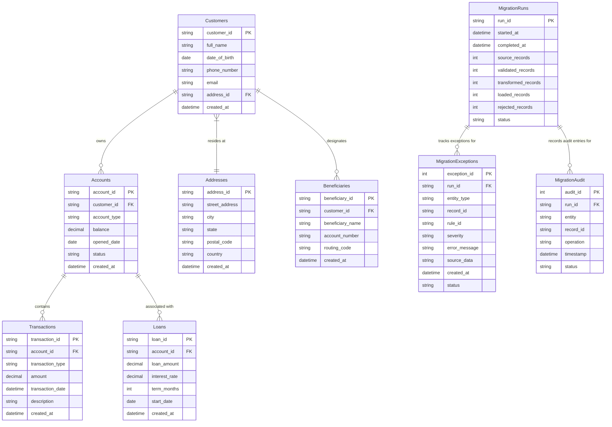

# Data Mapping & Entity-Relationship Specifications

## Overview
This document specifies the legacy database schema, target normalized schema, and the transformation rules mapping legacy fields to clean target entities.

---

## Legacy Database Schema (`BankMigrate_Legacy`)

The legacy schema consists of 6 tables. Relationships are not strictly enforced in the engine to simulate dirty legacy data containing orphaned records and invalid foreign keys.

> [!NOTE]  
> In `BankMigrate_Legacy`, foreign key constraints are omitted or non-enforcing at the database level to permit seeding dirty data (e.g., transactions referencing nonexistent account IDs like `A999999`).

---

## Target Database Schema (`BankMigrate_Target`)

The target schema consists of 9 normalized tables with enforced primary keys, foreign keys, constraints, and operation tracking tables.

---

## Field-Mapping Catalog

| Entity | Legacy Field | Target Field | Data Type Transformation | Cleaning / Normalization Rule |
| :--- | :--- | :--- | :--- | :--- |
| **Customer** | `customer_id` | `customer_id` | `NVARCHAR(50)` | Trim whitespace; reject NULL or empty |
| **Customer** | `customer_name` | `full_name` | `NVARCHAR(100)` | Strip spaces, convert to Title Case (`john smith` $\rightarrow$ `John Smith`) |
| **Customer** | `dob` | `date_of_birth` | `DATE` | Parse multi-format dates (`DD/MM/YYYY`, `YYYY-MM-DD`, `MM-DD-YYYY`) to ISO `YYYY-MM-DD` |
| **Customer** | `phone` | `phone_number` | `NVARCHAR(20)` | Strip non-digits (`+91-`, spaces); enforce 10-12 digit format |
| **Customer** | `email` | `email` | `NVARCHAR(100)` | Trim, convert to lowercase, validate regex format (`user@domain.com`) |
| **Customer** | `address_id` | `address_id` | `NVARCHAR(50)` | Foreign key reference to Addresses table |
| **Account** | `account_id` | `account_id` | `NVARCHAR(50)` | Primary Key; trim whitespace |
| **Account** | `customer_id` | `customer_id` | `NVARCHAR(50)` | Foreign Key check against valid Target Customers |
| **Account** | `account_type` | `account_type` | `NVARCHAR(20)` | Normalize to UPPERCASE (`SAVINGS`, `CHECKING`, `LOAN`) |
| **Account** | `balance` | `balance` | `DECIMAL(18,2)` | Validate non-negative for Savings/Checking |
| **Account** | `opened_date` | `opened_date` | `DATE` | Parse to ISO `YYYY-MM-DD` |
| **Account** | `status` | `status` | `NVARCHAR(20)` | Upper Case (`ACTIVE`, `CLOSED`, `DORMANT`) |
| **Transaction** | `transaction_id` | `transaction_id` | `NVARCHAR(50)` | Primary Key; trim whitespace |
| **Transaction** | `account_id` | `account_id` | `NVARCHAR(50)` | Foreign Key check against valid Target Accounts |
| **Transaction** | `transaction_type` | `transaction_type` | `NVARCHAR(20)` | Upper Case (`DEPOSIT`, `WITHDRAWAL`, `TRANSFER`) |
| **Transaction** | `amount` | `amount` | `DECIMAL(18,2)` | Must be non-zero positive number |
| **Transaction** | `transaction_date` | `transaction_date` | `DATETIME2` | Parse date/time string to standard timestamp |
| **Transaction** | `description` | `description` | `NVARCHAR(255)` | Clean trailing spaces |
