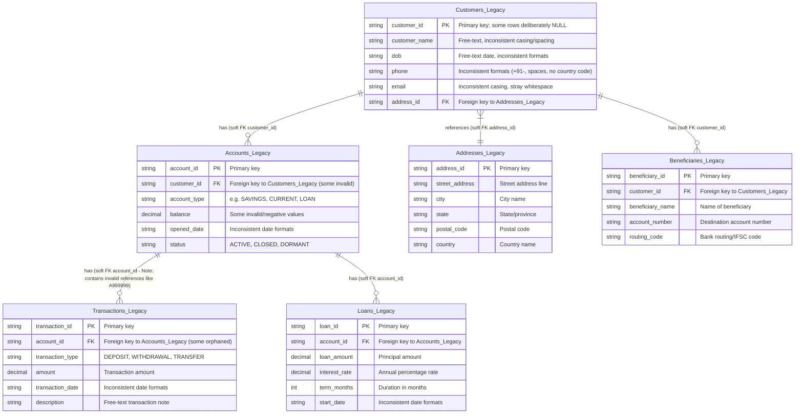
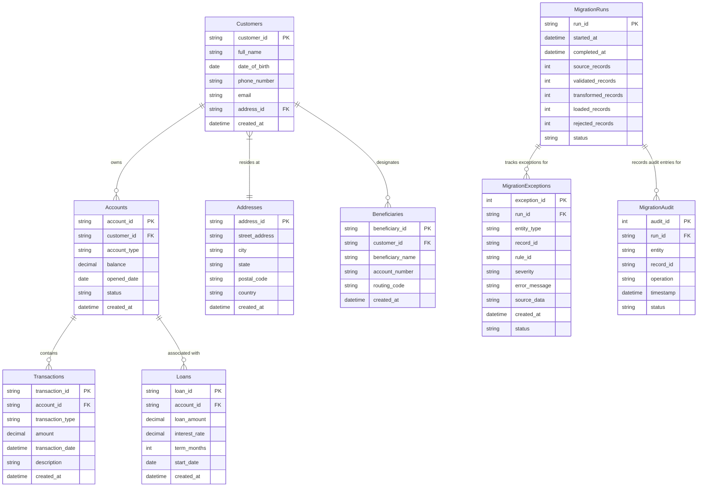

# Data Mapping & Entity-Relationship Specifications

## Overview
This document specifies the legacy database schema (`BankMigrate_Legacy`), target normalized schema (`BankMigrate_Target`), entity-relationship models, and the comprehensive field-by-field mapping catalog detailing data cleaning, casing normalization, format parsing, and data type conversions.

---

## Legacy Database Schema (`BankMigrate_Legacy`)

The legacy schema consists of 6 tables. Constraints are deliberately omitted in the legacy database to allow seeding dirty data, orphaned foreign keys, duplicate records, and unparseable data types.

---

## Target Database Schema (`BankMigrate_Target`)

The target schema consists of 9 normalized tables enforcing strict primary keys, foreign keys, non-null constraints, and data-type precision.

---

## Detailed Field-by-Field Mapping Catalog

### 1. Customer Entity Mapping (`Customers_Legacy` $\rightarrow$ `Customers`)

| Legacy Field | Target Field | Target SQL Type | Transformation / Normalization Algorithm | Sample Input $\rightarrow$ Output |
| :--- | :--- | :--- | :--- | :--- |
| `customer_id` | `customer_id` | `NVARCHAR(50)` | Trim leading/trailing whitespace. Must be non-null and unique. | `' C001 '` $\rightarrow$ `'C001'` |
| `customer_name` | `full_name` | `NVARCHAR(200)` | Strip extra inner/outer whitespace, capitalize words to Title Case (`str.title()`). | `' john smith '` $\rightarrow$ `'John Smith'` |
| `dob` | `date_of_birth` | `DATE` | Multi-format date parsing (`YYYY-MM-DD`, `DD/MM/YYYY`, `MM-DD-YYYY`) to standard ISO `YYYY-MM-DD`. Reject invalid dates (e.g. `31/02/1999`). | `'1985-05-15'` $\rightarrow$ `1985-05-15` |
| `phone` | `phone_number` | `NVARCHAR(50)` | Strip non-numeric formatting characters (`+`, `-`, `()`, spaces). Normalize 10-digit/11-digit numbers to standard numeric string. | `'+91-98765-43210'` $\rightarrow$ `'9876543210'` |
| `email` | `email` | `NVARCHAR(200)` | Trim whitespace and convert to lowercase (`str.lower()`). Validate regex `^[a-zA-Z0-9_.+-]+@[a-zA-Z0-9-]+\.[a-zA-Z0-9-.]+$`. | `' JOHN.SMITH@GMAIL.COM '` $\rightarrow$ `'john.smith@gmail.com'` |
| `address_id` | `address_id` | `NVARCHAR(50)` | Trim whitespace. Must reference valid `Addresses` table entry or NULL. | `' ADDR001 '` $\rightarrow$ `'ADDR001'` |
| N/A | `created_at` | `DATETIME2` | Automatically populated with system timestamp (`SYSDATETIME()`). | N/A $\rightarrow$ `2026-08-21 03:00:00` |

---

### 2. Account Entity Mapping (`Accounts_Legacy` $\rightarrow$ `Accounts`)

| Legacy Field | Target Field | Target SQL Type | Transformation / Normalization Algorithm | Sample Input $\rightarrow$ Output |
| :--- | :--- | :--- | :--- | :--- |
| `account_id` | `account_id` | `NVARCHAR(50)` | Trim whitespace; primary key. | `' A001 '` $\rightarrow$ `'A001'` |
| `customer_id` | `customer_id` | `NVARCHAR(50)` | Foreign key validation check against clean `Customers` table. Reject if orphan. | `'C001'` $\rightarrow$ `'C001'` |
| `account_type` | `account_type` | `NVARCHAR(50)` | Trim whitespace and convert to uppercase (`SAVINGS`, `CHECKING`, `CURRENT`, `LOAN`). | `'savings'` $\rightarrow$ `'SAVINGS'` |
| `balance` | `balance` | `DECIMAL(18,2)` | Cast to 2-decimal place numeric. Enforce non-negative rule for Savings/Checking (`balance >= 0`). | `15000.5` $\rightarrow$ `15000.50` |
| `opened_date` | `opened_date` | `DATE` | Parse multi-format dates to ISO `YYYY-MM-DD`. | `'2020-01-15'` $\rightarrow$ `2020-01-15` |
| `status` | `status` | `NVARCHAR(50)` | Uppercase normalization (`ACTIVE`, `CLOSED`, `DORMANT`). | `'active'` $\rightarrow$ `'ACTIVE'` |

---

### 3. Transaction Entity Mapping (`Transactions_Legacy` $\rightarrow$ `Transactions`)

| Legacy Field | Target Field | Target SQL Type | Transformation / Normalization Algorithm | Sample Input $\rightarrow$ Output |
| :--- | :--- | :--- | :--- | :--- |
| `transaction_id` | `transaction_id` | `NVARCHAR(50)` | Trim whitespace; primary key. Deduplicate exact matching rows. | `' TXN-1001 '` $\rightarrow$ `'TXN-1001'` |
| `account_id` | `account_id` | `NVARCHAR(50)` | Foreign key validation check against clean `Accounts` table. Reject orphan `A999999`. | `'A001'` $\rightarrow$ `'A001'` |
| `transaction_type` | `transaction_type` | `NVARCHAR(50)` | Convert to uppercase (`DEPOSIT`, `WITHDRAWAL`, `TRANSFER`). | `'deposit'` $\rightarrow$ `'DEPOSIT'` |
| `amount` | `amount` | `DECIMAL(18,2)` | Must be non-zero positive decimal (`amount > 0`). | `1000` $\rightarrow$ `1000.00` |
| `transaction_date` | `transaction_date` | `DATETIME2` | Parse date/time string to standard timestamp `YYYY-MM-DD HH:MM:SS`. | `'2026-08-01 10:00:00'` $\rightarrow$ `2026-08-01 10:00:00` |
| `description` | `description` | `NVARCHAR(255)` | Trim leading/trailing whitespace. Default empty string if NULL. | `' Salary Deposit '` $\rightarrow$ `'Salary Deposit'` |

---

### 4. Loan Entity Mapping (`Loans_Legacy` $\rightarrow$ `Loans`)

| Legacy Field | Target Field | Target SQL Type | Transformation / Normalization Algorithm | Sample Input $\rightarrow$ Output |
| :--- | :--- | :--- | :--- | :--- |
| `loan_id` | `loan_id` | `NVARCHAR(50)` | Trim whitespace; primary key. | `'LN-501'` $\rightarrow$ `'LN-501'` |
| `account_id` | `account_id` | `NVARCHAR(50)` | Foreign key reference to `Accounts` table. | `'A005'` $\rightarrow$ `'A005'` |
| `loan_amount` | `loan_amount` | `DECIMAL(18,2)` | Cast to decimal; must be $> 0$. | `25000` $\rightarrow$ `25000.00` |
| `interest_rate` | `interest_rate` | `DECIMAL(5,2)` | Annual interest rate percentage. | `5.5` $\rightarrow$ `5.50` |
| `term_months` | `term_months` | `INT` | Loan duration in months; must be $> 0$. | `60` $\rightarrow$ `60` |
| `start_date` | `start_date` | `DATE` | Parse date string to ISO `YYYY-MM-DD`. | `'2022-05-20'` $\rightarrow$ `2022-05-20` |

---

### 5. Beneficiary Entity Mapping (`Beneficiaries_Legacy` $\rightarrow$ `Beneficiaries`)

| Legacy Field | Target Field | Target SQL Type | Transformation / Normalization Algorithm | Sample Input $\rightarrow$ Output |
| :--- | :--- | :--- | :--- | :--- |
| `beneficiary_id` | `beneficiary_id` | `NVARCHAR(50)` | Trim whitespace; primary key. | `'BEN-01'` $\rightarrow$ `'BEN-01'` |
| `customer_id` | `customer_id` | `NVARCHAR(50)` | Foreign key reference to `Customers` table. | `'C001'` $\rightarrow$ `'C001'` |
| `beneficiary_name` | `beneficiary_name` | `NVARCHAR(200)` | Convert to Title Case and strip outer whitespace. | `' mary smith '` $\rightarrow$ `'Mary Smith'` |
| `account_number` | `account_number` | `NVARCHAR(50)` | Strip non-numeric characters. | `'987654321'` $\rightarrow$ `'987654321'` |
| `routing_code` | `routing_code` | `NVARCHAR(50)` | Convert to uppercase. | `'rout001'` $\rightarrow$ `'ROUT001'` |

---

### 6. Address Entity Mapping (`Addresses_Legacy` $\rightarrow$ `Addresses`)

| Legacy Field | Target Field | Target SQL Type | Transformation / Normalization Algorithm | Sample Input $\rightarrow$ Output |
| :--- | :--- | :--- | :--- | :--- |
| `address_id` | `address_id` | `NVARCHAR(50)` | Trim whitespace; primary key. | `'ADDR001'` $\rightarrow$ `'ADDR001'` |
| `street_address` | `street_address` | `NVARCHAR(255)` | Strip outer spaces, normalize street abbreviations (`St` $\rightarrow$ `Street`). | `' 123 Financial Way '` $\rightarrow$ `'123 Financial Way'` |
| `city` | `city` | `NVARCHAR(100)` | Convert to Title Case. | `'new york'` $\rightarrow$ `'New York'` |
| `state` | `state` | `NVARCHAR(100)` | Convert to uppercase standard code/name. | `'ny'` $\rightarrow$ `'NY'` |
| `postal_code` | `postal_code` | `NVARCHAR(20)` | Trim whitespace. | `' 10001 '` $\rightarrow$ `'10001'` |
| `country` | `country` | `NVARCHAR(100)` | Convert to standard uppercase/Title Case. | `'usa'` $\rightarrow$ `'USA'` |
