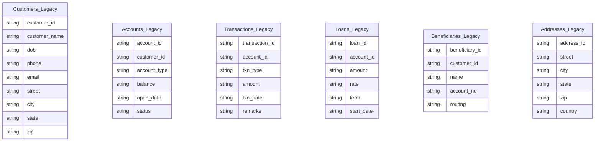
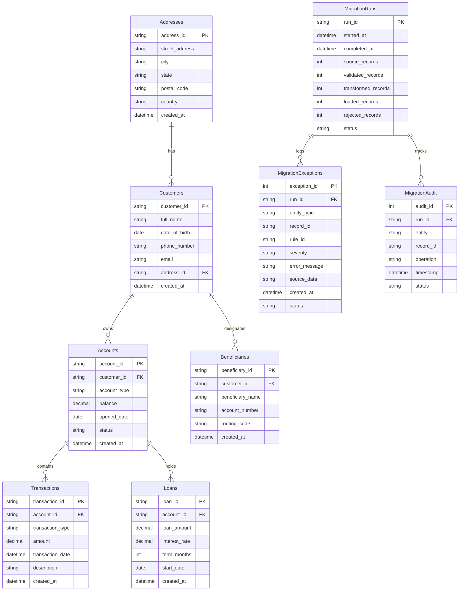

# BankMigrate — Database Schema & Data Dictionary

## 1. Legacy Schema (`BankMigrate_Legacy`)
The legacy database schema consists of 6 unconstrained tables without SQL `PRIMARY KEY` or `FOREIGN KEY` definitions. All fields are defined as `NVARCHAR` and `NULLable` to simulate dirty legacy enterprise data.

---

## 2. Target & Operational Schema (`BankMigrate_Target`)
The target database schema consists of 6 normalized banking entity tables enforcing strict relational constraints (`PRIMARY KEY`, `FOREIGN KEY`, `NOT NULL`, explicit types) and 3 operational pipeline management tables.

---

## 3. T-SQL Stored Procedure Catalog
1. `sp_detect_duplicates`: Uses window functions (`ROW_NUMBER() OVER (PARTITION BY ...)`).
2. `sp_validate_customers`: Customer validation using CTEs, `#CustExceptions`, and `TRY...CATCH`.
3. `sp_validate_accounts`: Account FK and balance validation.
4. `sp_validate_transactions`: Transaction validation.
5. `sp_reconcile_migration`: Calculates record count & monetary amount balance.
6. `sp_generate_migration_summary`: Produces run-level summary report.

---

## 4. Security & Indexing Strategy
- **Indexes:** Primary keys index automatically as clustered unique indexes. Foreign keys (`FK_Customers_Addresses`, `FK_Accounts_Customers`, `FK_Transactions_Accounts`) use non-clustered indexes for high-speed JOIN execution.
- **Least-Privilege Security Role:** `bankmigrate_app_role` created with `SELECT`, `INSERT`, `UPDATE`, `EXECUTE` privileges on target schema, denying `ALTER` or sysadmin access.
