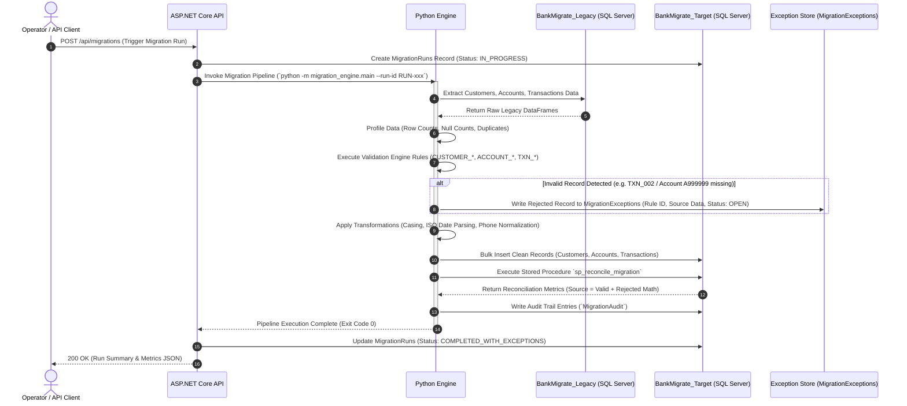

# Migration Execution Runbook

## Overview
This runbook documents the step-by-step procedures required to execute, monitor, and verify a migration batch run using BankMigrate.

---

## Migration Call Sequence

The sequence diagram below visualizes the execution flow between ASP.NET Core API, Python Migration Engine, SQL Server databases, and the Exception Store.



---

## Step-by-Step Execution Guide

### Step 1: Verify Source Database
Connect to SQL Server and verify source tables contain data:
```sql
USE BankMigrate_Legacy;
SELECT COUNT(*) FROM Customers_Legacy;
SELECT COUNT(*) FROM Accounts_Legacy;
SELECT COUNT(*) FROM Transactions_Legacy;
```

### Step 2: Validate Connectivity
Ensure environment variables are configured in `.env`:
```env
DB_HOST=localhost
DB_PORT=1433
DB_USER=sa
DB_PASSWORD=BankMigrate123!
```
Run connectivity check:
```bash
./venv/bin/python -m migration_engine.config
```

### Step 3: Create Migration Run
Trigger migration via HTTP POST request to API endpoint:
```bash
curl -X POST http://localhost:5000/api/migrations
```

### Step 4: Execute Extraction
The Python engine extracts legacy records from `BankMigrate_Legacy` into Pandas DataFrames.

### Step 5: Run Validation
Applies rules from `docs/validation-rules.md` to split records into `Valid` and `Invalid` DataFrames.

### Step 6: Review Exceptions
Query isolated exceptions via API or SQL:
```bash
curl http://localhost:5000/api/migrations/RUN-20260821-001/exceptions
```

### Step 7: Transform Valid Records
Cleans casing, formats dates to ISO standards, normalizes phone numbers.

### Step 8: Load Target
Performs transactional bulk inserts into `BankMigrate_Target`.

### Step 9: Run Reconciliation
Executes `sp_reconcile_migration` to verify mathematical balance:
$$\text{Source Count} = \text{Valid Count} + \text{Rejected Count}$$

### Step 10: Review Migration Report
Retrieve final summary report:
```bash
curl http://localhost:5000/api/migrations/RUN-20260821-001/reconciliation
```
