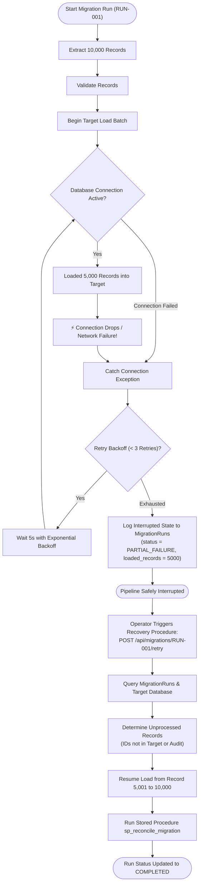

# Operational Troubleshooting & Recovery Guide

## Overview
This guide provides resolution procedures for common operational failure scenarios, including network disconnects, data corruption, referential failures, and partial batch resume workflows.

---

## Failure & Recovery Flow (Partial Migration Scenario 4)

The diagram below details how the engine handles Scenario 4 (Partial Migration), where a database connection drops mid-run after processing partial records (e.g. 5,000 out of 10,000 records).

---

## Known Failure Scenarios & Troubleshooting Procedures

### Scenario 1: Foreign-Key / Orphan Record Violations
- **Symptom:** Validation fails on rule `TXN_002` or `ACCOUNT_002`.
- **Possible Causes:**
  - Missing parent records in legacy database.
  - Incorrect natural key mapping.
  - Source data corruption.
- **Resolution:**
  1. Query `MigrationExceptions` for `rule_id = 'TXN_002'`.
  2. Inspect `source_data` column snapshot.
  3. Verify parent record in `Customers` or `Accounts`.
  4. Fix parent record or flag exception status as `RESOLVED`.

---

### Scenario 2: Connection Interruption Mid-Run
- **Symptom:** Connection error `pymssql.OperationalError` or `pyodbc.OperationalError`.
- **Resolution:**
  - Python engine automatically triggers backoff retry up to 3 attempts.
  - If database remains unavailable, transaction is rolled back for current batch.
  - Migration state is marked `PARTIAL_FAILURE`.
  - Operator re-runs `/api/migrations/{runId}/retry` after verifying SQL Server container status.

---

### Scenario 3: Malformed Date String Parsing
- **Symptom:** Validation failure on rule `CUSTOMER_005` (`31/02/1999`).
- **Resolution:**
  - Malformed dates are captured by validation engine regex/dateutil parsing.
  - Record is logged in `MigrationExceptions` with rule ID `CUSTOMER_005`.
  - Migration pipeline continues without throwing uncaught exceptions.
